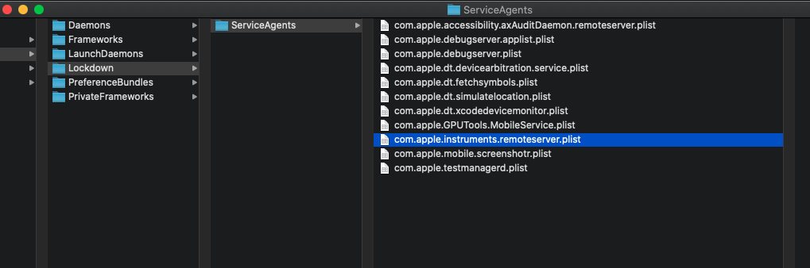
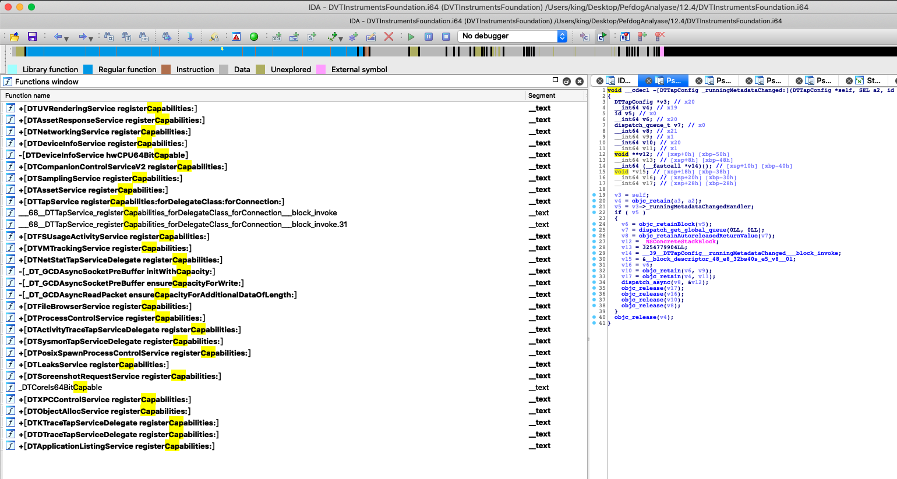
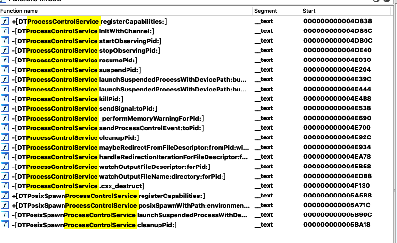
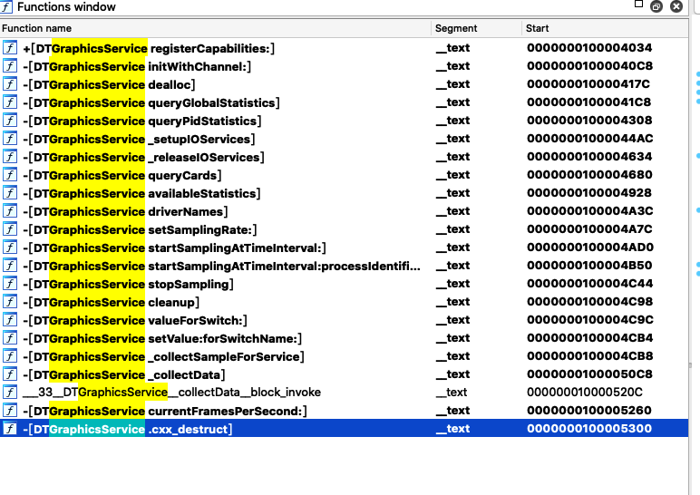

# IOS 启动内置  Instrument Server 与性能数据获取原理：

## 目的：
现在市面上能做到 <big> 跨平台</big> 监控数据的  <big>只有腾讯</big>  一家Perfdog，确实有技术含量。

## 结论：
本文主要阐述如何在Mac os下抛弃Xcode的情况下，直接启动，为后续的跨平台性能监控服务。

### 基本原理：
Apple公司为了方便自家项目，可以通过挂载dmg的方式在iOS中启动挂载的服务。本项目的做法是是挂载Xcode提供的DeveloperDiskImage.dmg来，与ios的lockdown server进行通讯，从而启动 DTServiceHub. 

### 前置知识：
* LaunchDaemon 与 LOCKDOWN
* DTXMessage
* USBMUX
* 关联库:
		* DeveloperDiskImage.dmg 
		* Xcode Plugin
		

* NSKeyarchieved and NSUnarchiver

-----

### 基本步骤：
1.挂载Developer Disk image 从而获取所有的性能服务功能
2.通过lockdown service 与 com.instrument.remoteserver进行handshake
3.从handshanke上获取Method Channel句柄
4.调用method 获取数据

-----
## 前置总结：
### LaunchDaemon列表
在 OS X 和 iOS 中有大量的LaunchDaemon。所有的plist文件（包括Mach服务条目）都以com.apple作为前缀，二进制可执行文件通常放在/usr/libexec 目录下。
在iOS 中有两个特殊的守护程序：SpringBoard 和 lockdownd。

#### lockdownd (大部分时间与它进行通讯)
lockdownd 就行用户态的狱警，是所有越狱者的头号敌人。lockdownd 由 launch 启动，负责设备激活、备份、崩溃报告、设备同步以及其他服务。lockdownd 注册 com.apple.lockdown.host_watcher Mach 服务，监听 TCP 端口 62078 以及 UNIX domain 套接字 /var/run/lockdown.sock。还有一个小程序/usr/libexec/lockbot 辅助lockdownd。lockdownd 实际上是一个迷你launchd. lockdownd 在 /System/Library/Lockdown/Services.plist 文件中维护了一个自己要启动的服务列表。这个列表中有一个重要的服务：afc，这个服务负责在 iTunes 主机和 i- 设备之间传递文件。lockdown 和 luanchd一样 以root 用户权限预先，在运行其他进程之前，如果指定了UserName 键，则会降低进程的权限。

作者：CoderKo1o
链接：https://www.jianshu.com/p/5f5c8eb9bac8
来源：简书
著作权归作者所有。商业转载请联系作者获得授权，非商业转载请注明出处。

#### DTXMessage

详情请查看，这位大佬的解析：

https://recon.cx/2018/montreal/schedule/system/event_attachments/attachments/000/000/043/original/RECON-MTL-2018-Discovering_the_iOS_Instruments_Server.pdf

打开了后台启动的大门，他的开源项目是基于直接使用Mac os下的库进行对iOS的访问

#### 本次项目逆向研究了的库文件：
##### DeveloperDiskImage.dmg 挂载在iOS上的dmg, 目的是为了挂载其中的
com.apple.remoteserver 等服务。图中所有的其他服务，本次只研究remoteserver.

DVTInstrumentsFoundation.Framework:

#### DTServiceHub
		在xocde或者perdog启动的时候，这个servicehub就会在htop里面排行前几，说明它是启动的根本。挂在了DeveloperDiskImage.dmg以后，设备会启动DTServiceHub，一般情况下会处于休眠状态。

#### DTInstrumentsFoundation
		  图片是为了展示 InstrumentsFoundation 的所有能力
		  从这里的分析来看，所有的registerCapilites都是单例，也就是说，在启动remoteserver的时候，这些Channel都已经是已经注册功能的。往后如果需要查看某个Channel的调用函数，就可以去查看下这个类库. 每个单例对应着每种能力，可以通过idenity来获取Channel句柄

### Mac os 上的关联库
##### IDEiOSSupportCore 
这个库的目的是，查看在mac os上如何启动xcode的 

##### DTXConnectionServices
这个库的目的，包含了很多基类，比如说DTXMessage

## USBMUX：
* 这是一个Apple公司自研的一个协议，并不公开，所以查阅的知识比较少，该协议的目的是：通过usb与 mac端建立tcp连接，从而进行通讯。
* libusbmuxd 第三方开源库，从而跨平台的通讯能力
* libmobiledevice 这个库比较牛逼，现在基本的xx助手都是基于它来做的。
			https://github.com/libimobiledevice/libimobiledevice 

-----

### 步骤详细描述:

* MobileDevice.AMDeviceConnect  (连接)
* MobileDevice.AMDeviceIsPaired （是否同意信任电脑）
* MobileDevice.AMDeviceValidatePairing （信任是否有效）
* MobileDevice.AMDeviceStartSession     (开始对话)

完成这4步以后基本可以进行获取Channel句柄，从而调用他的方法了。(下面的图片即是调用的方法名)
#### Instrument server比较重要的几个服务：
idenity : _notifyOfPublishedCapabilities:
* 参数： com.apple.private.DTXBlockCompression = 2
* 参数： com.apple.private.DTXConnection       = 1

通过此方法可以获取所有的Channel列表，如附件：

-----

##### DTProcessControlService (进程服务)
idenity :com.apple.instruments.server.services.processcontrol
作用:掌握着所有进程服务的服务：启动进程，杀死进程，等等

##### DTTapService 
idenity : com.apple.instruments.server.services.sysmontap
获取设备的性能信息.

#### DTGraphicsService 
idenity : com.apple.instruments.server.services.graphics.opengl

踩坑过程：
1.Channel com.apple.instruments.server.services.sysmontap 需要设置正确的SetConfig以后才能正确启动。

附件：
可以从下面的idenity中获取Channel句柄从而调用服务

    "com.apple.dt.Instruments.inlineCapabilities" = 1;  
    "com.apple.dt.Xcode.WatchProcessControl" = 3;
    "com.apple.dt.services.capabilities.vmtracking" = 1;
    "com.apple.instruments.server.services.activitytracetap" = 6;
    "com.apple.instruments.server.services.activitytracetap.deferred" = 1;
    "com.apple.instruments.server.services.activitytracetap.immediate" = 1;
    "com.apple.instruments.server.services.activitytracetap.windowed" = 1;
    "com.apple.instruments.server.services.assets" = 4;
    "com.apple.instruments.server.services.assets.response" = 2;
    "com.apple.instruments.server.services.coreprofilesessiontap" = 2;
    "com.apple.instruments.server.services.coreprofilesessiontap.deferred" = 1;
    "com.apple.instruments.server.services.coreprofilesessiontap.immediate" = 1;
    "com.apple.instruments.server.services.coreprofilesessiontap.multipleTimeTriggers" = 1;
    "com.apple.instruments.server.services.coreprofilesessiontap.pmc" = 1;
    "com.apple.instruments.server.services.coreprofilesessiontap.pmi" = 1;
    "com.apple.instruments.server.services.coreprofilesessiontap.windowed" = 1;
    "com.apple.instruments.server.services.coresampling" = 10;
    "com.apple.instruments.server.services.device.applictionListing" = 1;
    "com.apple.instruments.server.services.device.xpccontrol" = 2;
    "com.apple.instruments.server.services.deviceinfo" = 108;
    "com.apple.instruments.server.services.deviceinfo.app-life-cycle" = 1;
    "com.apple.instruments.server.services.deviceinfo.dyld-tracing" = 1;
    "com.apple.instruments.server.services.deviceinfo.energytracing.location" = 1;
    "com.apple.instruments.server.services.deviceinfo.gcd-perf" = 1;
    "com.apple.instruments.server.services.deviceinfo.metal" = 1;
    "com.apple.instruments.server.services.deviceinfo.recordOptions" = 1;
    "com.apple.instruments.server.services.deviceinfo.scenekit-tracing" = 1;
    "com.apple.instruments.server.services.deviceinfo.systemversion" = 120403;
    "com.apple.instruments.server.services.filetransfer" = 1;
    "com.apple.instruments.server.services.filetransfer.debuginbox" = 1;
    "com.apple.instruments.server.services.fsusage" = 2;
    "com.apple.instruments.server.services.fsusage.deferred" = 1;
    "com.apple.instruments.server.services.fsusage.immediate" = 1;
    "com.apple.instruments.server.services.graphics.coreanimation" = 1;
    "com.apple.instruments.server.services.graphics.coreanimation.deferred" = 1;
    "com.apple.instruments.server.services.graphics.coreanimation.immediate" = 1;
    "com.apple.instruments.server.services.graphics.opengl" = 1;
    "com.apple.instruments.server.services.graphics.opengl.deferred" = 1;
    "com.apple.instruments.server.services.graphics.opengl.immediate" = 1;
    "com.apple.instruments.server.services.graphics.openglesanalyzer" = 1;
    "com.apple.instruments.server.services.graphics.openglesanalyzer.deferred" = 1;
    "com.apple.instruments.server.services.graphics.openglesanalyzer.immediate" = 1;
    "com.apple.instruments.server.services.mobilenotifications" = 1;
    "com.apple.instruments.server.services.networking" = 2;
    "com.apple.instruments.server.services.networking.deferred" = 1;
    "com.apple.instruments.server.services.networking.immediate" = 1;
    "com.apple.instruments.server.services.objectalloc" = 4;
    "com.apple.instruments.server.services.objectalloc.deferred" = 1;
    "com.apple.instruments.server.services.objectalloc.immediate" = 1;
    "com.apple.instruments.server.services.objectalloc.zombies" = 1;
    "com.apple.instruments.server.services.power" = 1;
    "com.apple.instruments.server.services.power.deferred" = 1;
    "com.apple.instruments.server.services.power.immediate" = 1;
    "com.apple.instruments.server.services.processcontrol" = 107;
    "com.apple.instruments.server.services.processcontrol.capability.signal" = 1;
    "com.apple.instruments.server.services.processcontrol.feature.deviceio" = 103;
    "com.apple.instruments.server.services.processcontrolbydictionary" = 3;
    "com.apple.instruments.server.services.remoteleaks" = 6;
    "com.apple.instruments.server.services.remoteleaks.deferred" = 1;
    "com.apple.instruments.server.services.remoteleaks.immediate" = 1;
    "com.apple.instruments.server.services.sampling" = 11;
    "com.apple.instruments.server.services.sampling.deferred" = 1;
    "com.apple.instruments.server.services.sampling.immediate" = 1;
    "com.apple.instruments.server.services.screenshot" = 1;
    "com.apple.instruments.server.services.sysmontap" = 2;
    "com.apple.instruments.server.services.sysmontap.deferred" = 1;
    "com.apple.instruments.server.services.sysmontap.immediate" = 1;
    "com.apple.instruments.server.services.sysmontap.processes" = 1;
    "com.apple.instruments.server.services.sysmontap.system" = 1;
    "com.apple.instruments.server.services.sysmontap.windowed" = 1;
    "com.apple.instruments.server.services.vmtracking" = 1;
    "com.apple.instruments.server.services.vmtracking.deferred" = 1;
    "com.apple.instruments.server.services.vmtracking.immediate" = 1;
    "com.apple.instruments.server.services.wireless" = 1;
    "com.apple.instruments.target.ios" = 120403;
    "com.apple.instruments.target.logical-cpus" = 2;
    "com.apple.instruments.target.mtb.denom" = 3;
    "com.apple.instruments.target.mtb.numer" = 125;
    "com.apple.instruments.target.physical-cpus" = 2;
    "com.apple.instruments.target.user-page-size" = 16384;
    "com.apple.private.DTXBlockCompression" = 2;
    "com.apple.private.DTXConnection" = 1;
    "com.apple.xcode.debug-gauge-data-providers.Energy" = 1;
    "com.apple.xcode.debug-gauge-data-providers.NetworkStatistics" = 1;
    "com.apple.xcode.debug-gauge-data-providers.SceneKit" = 1;
    "com.apple.xcode.debug-gauge-data-providers.SpriteKit" = 1;
    "com.apple.xcode.debug-gauge-data-providers.procinfo" = 1;
    "com.apple.xcode.debug-gauge-data-providers.resources" = 1;
    "com.apple.xcode.resource-control" = 1;
"""

